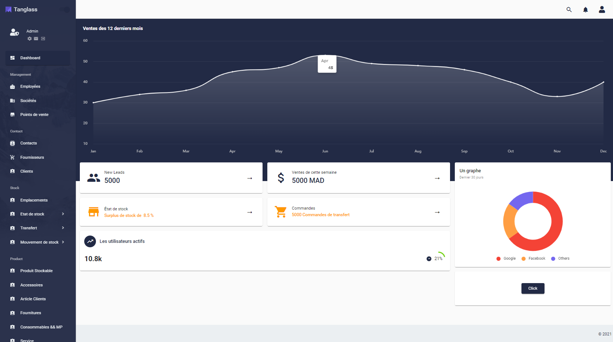
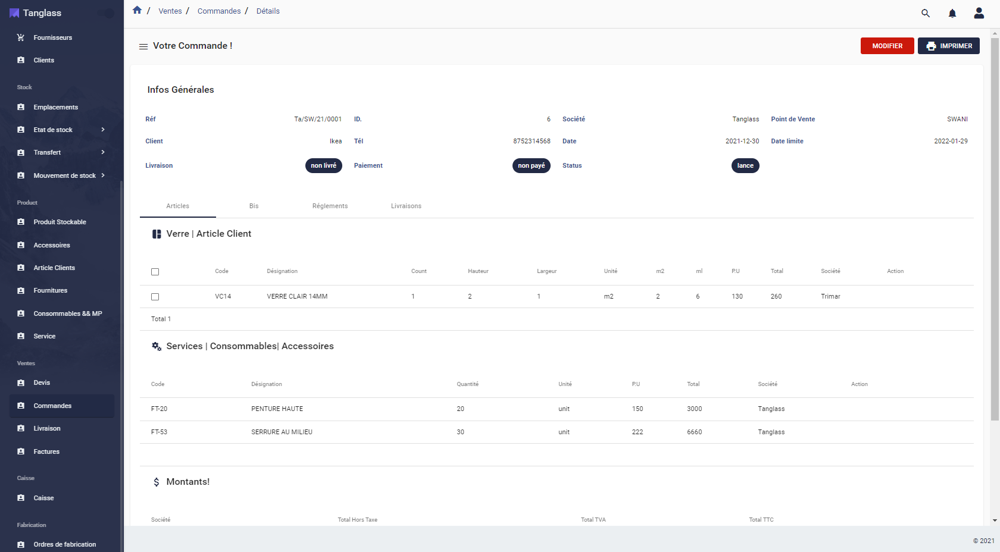
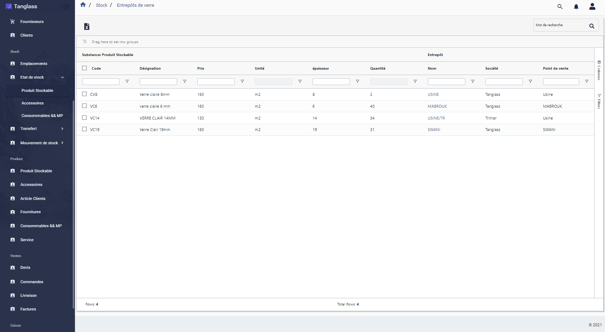
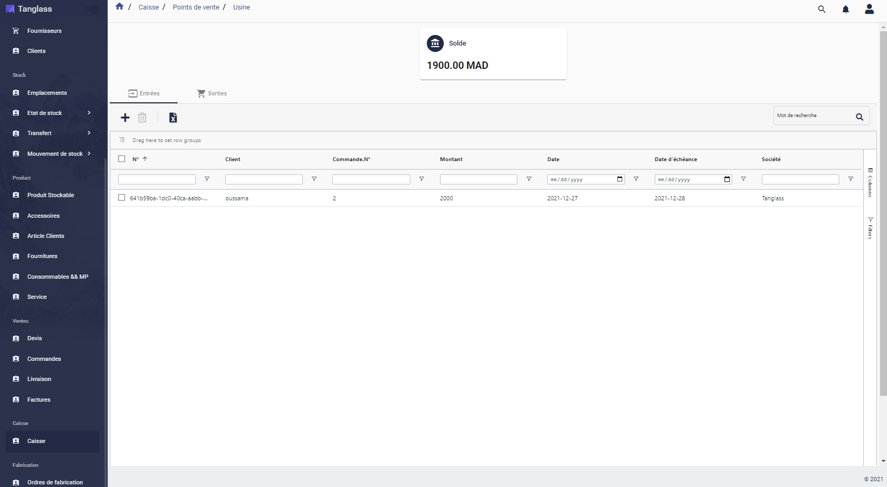

# TanglassERP 

TanglassERP is an entreprise resource planning software that  cover many core functions across your organization (either commercial or manufacturing sector), 
 as :
Commerce,Finance,Manufacturing ,Supply chain..; also it support multi-Company and multi-POS(Point of sale) management .
## Installation
 
Install Node.js (v14.15.3) For more information on installing Node.js, see   https://nodejs.org/en/

Install Nx CLI

```bash
  npm install -g nx
```

Install dependencies

```bash
  npm install
```

    
## Run Locally

Start the project

```bash
  npm start
```


## Tech Stack


**Back-end**: Hasura, PostgreSQL, Netlify, Auth0.

**Front**: Angular, Ag-Grid, Material, NgRx, RxJS, GraphQL, CodeGen, Apollo Client.

**CI/CD and tools**: Git, GitHub, Docker, Nrwl Nx.
## Demo

Project Link     : https://tanglass.cloudvision.dev

Credentials :  tanglass@gmail.com   x6Sas6bejzuLh3A 


## Contacts
Mohammad Al Mechkor    : medalmechkor@gmail.com


## API Reference

#### Graphql endpoint 

```http
  Post https://hasuratg.cloudvision.dev:8000/v1/graphql
```

| Parameter | Type     | Description                |
| :-------- | :------- | :------------------------- |
| `admin_secret` | `string` | **Required**.  API key |


## Screenshots 
DASHBOARD



ORDER



STOCK IN HAND



CASH REGISTRE




